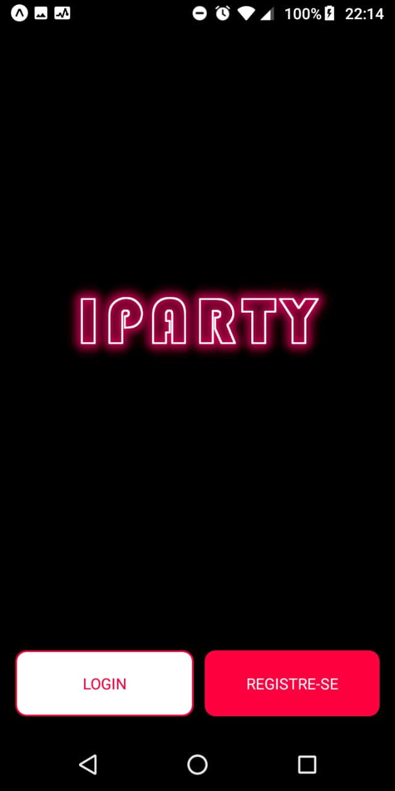
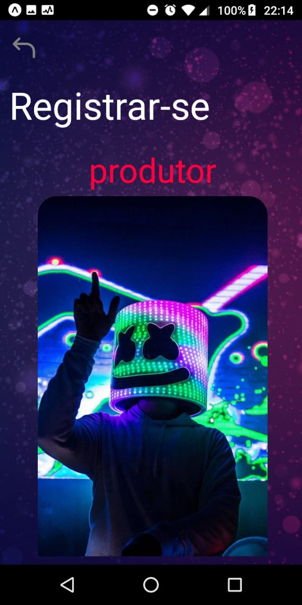
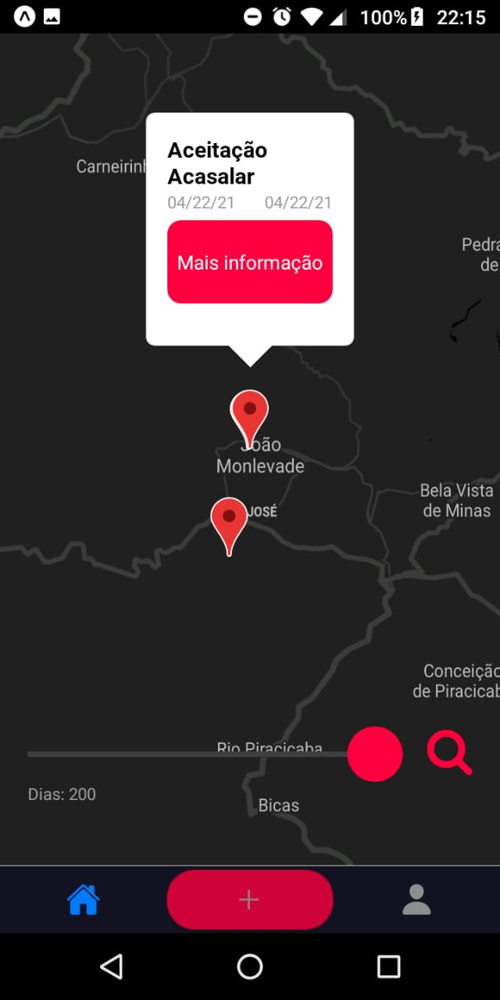
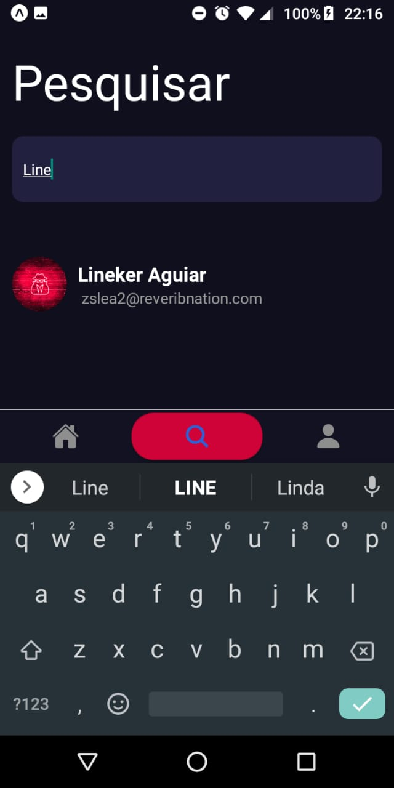
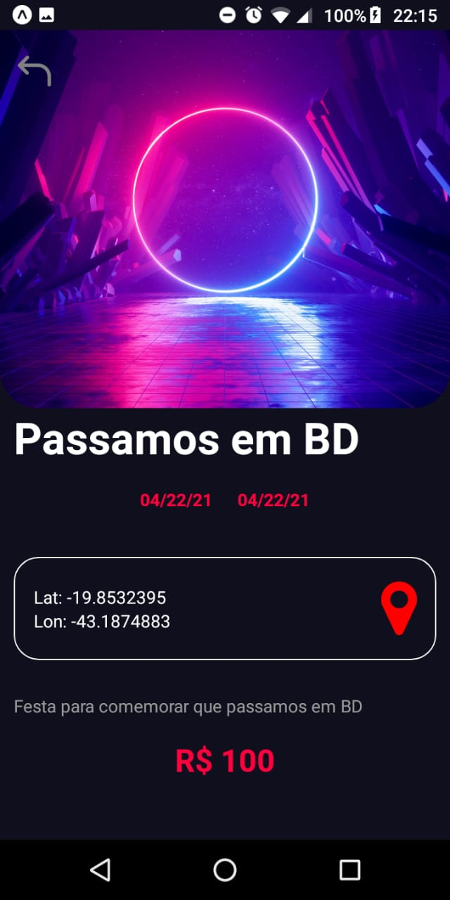

# <font color=#FF003E> IPARTY </font>

<div align="center" style="margin-top:40px;margin-bottom:40px">
  
  [](https://github.com/Lineker98/Iparty/) [](https://github.com/Lineker98/Iparty/) [](https://github.com/Lineker98/Iparty/) [](https://github.com/Lineker98/Iparty/issues) [](https://github.com/Lineker98/Iparty/pulls)

</div>

<div style="display:flex;flex:1;flex-direction:column;justify-content=center">
<div align="center" style="width:100%">
    
    
</div>

<div align="center" style="width:100%">
    
    
    
</div>
</div>

<div align="left" style="text-align:justify; margin-top:40px" >

<br>

O projeto aqui proposto é um aplicativo mobile focado em encontrar festas pertinho de você.

> Nosso objetivo foi criar uma plataforma que seja capaz de centralizar a divulgação para os produtores de eventos. Além disso, disponibiliza para os usuários que vão a festa informações úteis para melhorar sua experiência, como por exemplo, a localização do evento por meio de um mapa, a descrição, o preço e etc. 

O aplicativo foi criado utilizando o framework em javascript React Native para o frontend, node.js para o backend e por fim utilizamos Postgresql como SGBD. 

<br>
<hr/>

## ⚙️ Funcionalidades

Desenvolvido para a matéria de banco de dados, com o Iparty você será capaz de:

  - 💃 Registrar-se e fazer o login em nosso sistema;

  - 😜 Ter acesso ao seu perfil com o histórico dos rocks que você já participou;
  
  - 🌍 Interagir com um mapa que mostrará os rolês mais próximas de você;
  
  - 😍 Marcar presença nos eventos de seu interesse;

  - 😎 Criar festas caso você seja um produtor;
  

## 🛠️ Construído com

* Front end 
  * [Figma](https://www.figma.com/) - Ferramenta de prototipagem:
    * [Acesse aqui](https://www.figma.com/proto/5NWoqPKtgwMbaPqVgvXS27/Bd?node-id=27%3A234&scaling=scale-down) o nosso protótipo no Figma;
  * [React native](https://reactnative.dev/) - Framework;

* Back end
  * [Node.js](https://nodejs.org/en/) - Ambiente de execução JS;
  * [Postgresql](https://www.postgresql.org/) - SGBD.

## 📋 Pré-requisitos

Para modificar o aplicativo você precisará:

  - [Node 14.16.0 LTS](https://nodejs.org/en/download/)

Com o node em sua máquina, instale o Expo cli para modificar o front end. Caso algo não tenha dado certo, siga a documentação oficial do React Native [clicando aqui](https://reactnative.dev/docs/environment-setup)

```
npm install -g expo-cli
```

Alem disso:
  - Ter o app da expo instalado em seu celular android, [clique aqui](https://play.google.com/store/apps/details?id=host.exp.exponent&hl=pt_BR);
  - Ter o nosso repositório baixado em sua máquina, [clique aqui](https://github.com/Lineker98/Iparty/archive/refs/heads/main.zip).

## 🔧 Instalação do projeto na máquina local

Após fazer o download do repositório, entre no diretório da pasta e execute o seguinte comando: 

```bash
npm install 

sudo expo start
```

Isso gerará um qrCode que pode ser lido pelo aplicativo da expo.

Para Executar o back end basta entrar na pasta back end e executar: 

```bash
npm install

node server/server.js
```

Em App.js modifique o `global.URL_API` para o IP da sua máquina.

## 🧡 Autores

* [Jamisson Jader](https://github.com/jjader) - *Front end*
* [Lineker Alcantra](https://github.com/Lineker98) - *Back end* 

</div>
